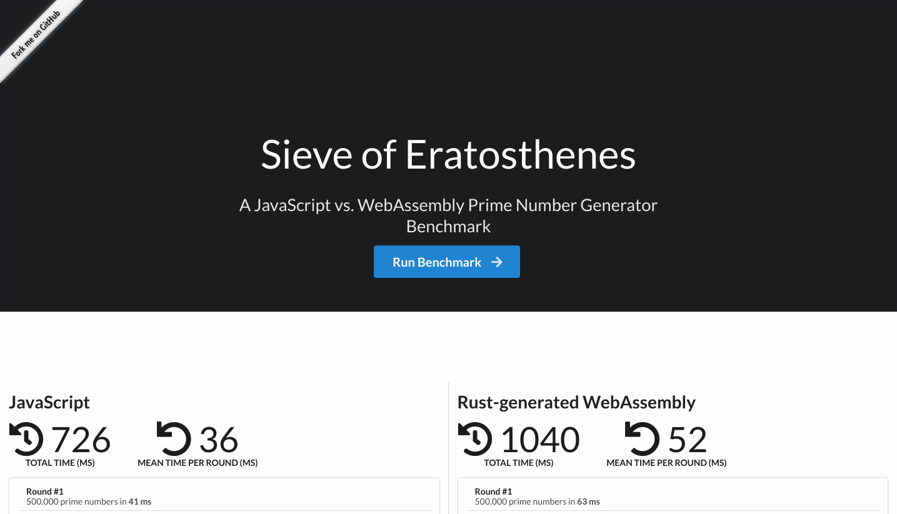

<table>
        <tr>
            <td></td>
            <td><strong>Archived Repository</strong> 
                    The code of this repository was written during a <strong>Hack Day</strong> by a <a href="https://marmelab.com/en/jobs">Marmelab developer</a>. It's part of the distributed R&D effort at Marmelab, where each developer spends 2 days a month for learning and experimentation. 
        <strong>This code is not intended to be used in production, and is not maintained.</strong>
        </td>
        </tr>
</table>

# Sieve of Eratosthenes

A JavaScript vs. WebAssembly Prime Number Generator Benchmark

## Rationale

[Eratosthenes](https://marmelab.com/eratosthenes/) is a small website build in one hackday at marmelab in order to answer the question: is Webassembly faster than plain JavaScript ?

To do so, we created bootstraped a [create-rust-webpack](https://github.com/rustwasm/rust-webpack-template#readme) project and benchmarked the computation of prime numbers with the [Sieve of Eratosthenes algorithm](https://en.wikipedia.org/wiki/Sieve_of_Eratosthenes).

## Getting Started

**Requirements**

-   [Node.js 10+](https://nodejs.org/en/)
-   [Rustup](https://rustup.rs/) (or Rust + Cargo)

**Run The App**

1. Install dependencies with `make install`

2. Run the app with `make run`

3. Go to http://localhost:8080

## License

Eratosthenes is licensed under the [MIT License](./LICENSE.md), courtesy of [marmelab](http://marmelab.com).
